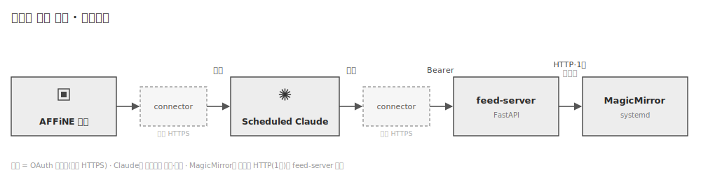

# 스마트 저널 미러 — 내게 힘이 되는 한마디

매일 쓰는 저널을 읽고, **전날의 어려움을 보듬고 희망을 상기시키는 한마디**를 아침마다 거울에 띄우는 개인용 스마트 미러.
하드웨어 제작부터 서버·커넥터·MagicMirror 앱까지 직접 설계하고 운영한 풀스택 사이드 프로젝트

> 이 저장소는 포트폴리오용 공개본입니다. 

---

## 목적

- 저널을 복귀하며 아침에 힘이 되는 한마디를 듣고 싶어서 설계됨.
- 스마트미러 하드웨어를 통해, 집중적인 공무/업무 환경을 유지하기 위함.
- 연계된 인프라 및 서비스를 소개하기 위함.

## 시연

- 실사용 영상: _(추가 예정)_
- 동작 요약: 매일 아침 거울 우상단에 **하루 요약**, 중앙에 **개인화된 한마디**, 하단에 **알아두면 좋은 소식**이 뜬다.

## 아키텍처



**흐름**

1. 매일 AFFiNE에 **저널**을 쓴다. → [`docs/journal-sample.md`](docs/journal-sample.md)
2. 새벽에 **스케줄된 Claude**가 저널(+주간 회고)을 affine mcp(connector)를 통해 읽는다. → [`docs/scheduled-prompt.md`](docs/scheduled-prompt.md)
3. Claude가 **개인화 한마디 / 하루 요약 / 소식**을 생성해 **MCP 도구**(`set_mirror_html`·`set_center_messages`·`set_bottom_messages`)로 `feed-server`에 저장한다.
   - Claude는 **OAuth 2.1 커넥터**로 공개 HTTPS 엔드포인트(`/mcp`)에 접속한다. 인증은 `mcp-oauth` 프록시가 처리한다.
4. **MagicMirror**의 커스텀 모듈 `MMM-MirrorFeed`가 **1분마다** `feed-server`의 읽기 API를 호출해 화면에 반영한다.
   - `top_right` ← `/api/html`(하루 요약, iframe) · `middle_center` ← `/api/center`(한마디) · `bottom_bar` ← `/api/bottom`(소식)

## 저장소 구성

| 경로 | 역할 |
| --- | --- |
| [`docs/journal-sample.md`](docs/journal-sample.md) | 저널 노트 양식 (실제 하루치 예시) |
| [`docs/scheduled-prompt.md`](docs/scheduled-prompt.md) | 스케줄 프롬프트 _(작성 예정)_ |
| [`affine/`](affine) | AFFiNE 셀프호스트(저널 저장소) docker-compose |
| [`mcp-oauth/`](mcp-oauth) | Claude 커넥터용 **OAuth 2.1 + PKCE 프록시** (서버 `server.js`) |
| [`feed-server/`](feed-server) | **magicmirror-feed-server** (FastAPI): 읽기/쓰기 API + MCP `/mcp` + Swagger `/docs` |
| [`magicmirror-app/`](magicmirror-app) | MagicMirror² 설정 + 커스텀 모듈 `MMM-MirrorFeed` |

## 기술 스택 · 설계 포인트

- **feed-server (FastAPI)** — 상태 변경 단일 진입점(쓰기 API) 위에 MCP를 래핑 by vibe code(FastMCP, Streamable HTTP, stateless·JSON). OpenAPI/Swagger 내장.
- **커넥터 보안** — MCP Authorization 스펙을 충족 by vibe code. AFFiNE 커넥터에 쓰던 OAuth 프록시를 **재사용**해 일관성 확보.
- **MagicMirror 모듈** — 서버에서 받아 저장·렌더하는 커스텀 모듈을 직접 작성. html은 파일로 캐싱 후 iframe, 메시지는 영역별 텍스트로 회전. **호스트·요청주기는 `.env`로 주입**. 라즈베리파이에서는 부팅 시 앱 자동 기동을 위해 **systemd 트리거(서비스)** 방식을 고려.
- **인프라/운영** — **홈랩(서버)**에 `feed-server`와 `mcp-oauth` 서버를 **Docker Compose**로 구성하고, **NPM(Nginx Proxy Manager)**과 **직접 구매한 도메인**으로 TLS를 종단해 OAuth 엔드포인트를 공개 HTTPS로 운영.

> 설계에서 신경 쓴 부분: ① 미러가 직접 가져가도록 **읽기/쓰기 책임 분리**, ② 비공개 LAN 서비스를 안전하게 외부 노출하기 위한 **OAuth 프록시 분리**, ③ 운영값을 코드에서 빼 **.env로 외부화**.

## 실행 (요약)

```bash
# 1) 피드 서버 (+ MCP/OAuth)
cd feed-server && docker compose up -d --build
curl localhost:8090/healthz        # {"ok":true}   ·   문서: http://localhost:8090/docs

# 2) MagicMirror 앱
cd magicmirror-app/run
cp original.env .env               # 최초 1회 (.env 는 git 미포함)
docker compose up -d --force-recreate
```

호스트/주기는 `magicmirror-app/run/.env`:

```bash
MIRROR_FEED_HOST=http://localhost:8090   # 피드 서버 주소
MIRROR_FEED_UPDATE_MS=60000              # 서버 요청주기(ms)
MIRROR_FEED_ROTATE_MS=12000              # 메시지 회전주기(ms)
```

자세한 네이티브(npm + systemd) 배포는 `magicmirror-app` 안내를 참고.

## 하드웨어 제작 · 설치 메뉴얼

**하드웨어 스펙 :**
- 디스플레이 : ZEUSLAP z16 lite
- 스펙 : 밝기-400nits / 사이즈- 16인치

**실험 : 하프필름 투과율**
디스플레이를 책상위에 평평하게 놓고 천장에서 거의 직접적으로 비추는 등을 켰을때, 간접적으로 비추는 등을 켰을때 두가지 환경을 구현하여 테스트 함
실험변수 : 투과율, 광량, 글씨크기


**설치 메뉴얼**
소프트웨어를 모르는 자가 라즈베리에 magicmirror를 설치할 수 있도록 제작
[`docs/install_manual.md`](docs/install_manual.md)


## 도메인 · 리버스 프록시

개인 서버에 **직접 도메인을 구매**해 운영 중이며, **리버스 프록시**로 TLS를 종단하고 `mcp-oauth`의 `/mcp` OAuth 엔드포인트를 **공개 HTTPS**로 노출한다. 피드 서버·MagicMirror는 내부 네트워크에만 두어 외부에는 OAuth로 보호되는 커넥터만 공개한다.
